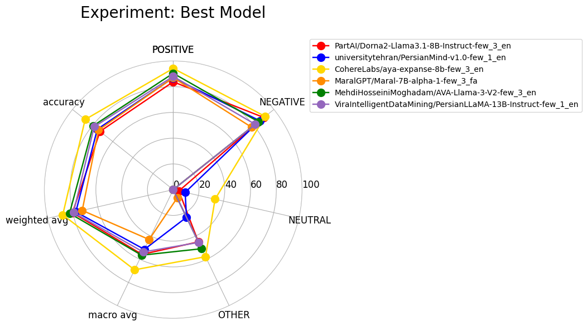

## Benchmarking Persian LLMs for Sentiment Analysis

This repository contains the code and results for the project, "Benchmarking Persian LLMs for Sentiment Analysis." The project investigates the effectiveness of several specialized Persian and multilingual Large Language Models (LLMs) on a sentiment analysis task, focusing on their performance compared to larger, general-purpose models like GPT-3.5 and GPT-4. We also explore the impact of supervised fine-tuning on a top performing model.

***

### ⚙️ Methodology

Our study was conducted on the sentiment analysis portion of the **ParsiNLU** dataset, specifically using food reviews from the Digikala e-commerce website. The dataset was preprocessed to merge similar sentiment labels (`positive`/`very positive` and `negative`/`very negative`) and aligned with the baseline study by Abaskouhi et al. to ensure comparable results.

We evaluated six different LLMs with parameter counts ranging from 7B to 13B. The models selected were:
- PartAI/Dorna2-Llama3.1-8B-Instruct (Monolingual)
- universitytehran/PersianMind-v1.0 (Cross-lingual)
- CohereLabs/aya-expanse-8b (Multilingual)
- MaralGPT/Maral-7B-alpha-1 (Cross-lingual)
- MehdiHosseiniMoghadam/AVA-Llama-3-V2 (Multilingual)
- ViraIntelligentDataMining/PersianLLaMA-13B-Instruct (Cross-lingual)

These models were evaluated using various prompting strategies, including zero-shot and few-shot (1-shot and 3-shot) prompts in both Persian and English. Performance was measured using the weighted average F1 score to account for the class imbalance in the dataset.

For the fine-tuning experiment, the best performing model, Aya-expanse-8B, was fine-tuned using a supervised fine-tuning (SFT) method on an unseen subset of the data for three epochs.

***

### 📊 Results

Our experiments yielded several key findings, including the effectiveness of lower-parameter models and the significant impact of fine-tuning.

#### **Model Performance with Prompting**

The models demonstrated a clear weakness in classifying the `NEUTRAL` and `OTHER` labels but performed well on the `POSITIVE` and `NEGATIVE` classes. Interestingly, most models showed better performance with English prompts than with Persian prompts. As shown in the table below, several models with lower parameters outperformed the GPT-3.5 baseline from the Abaskouhi et al. study.

**Table 1: F1 Score (Weighted Average) for LLMs Across Prompting Strategies**

| Model Name | Zero-Shot F1 (Weighted) | 1-Shot F1 (Weighted) | 3-Shot F1 (Weighted) |
| :--- | :--- | :--- | :--- |
| Dorna2-Llama3.1-8B | 0.457 (Persian) / 0.770 (English) | 0.496 (Persian) / 0.767 (English) | 0.444 (Persian) / **0.802 (English)** |
| PersianMind-v1.0 | 0.620 (Persian) / 0.678 (English) | 0.745 (Persian) / **0.775 (English)** | 0.751 (Persian) / 0.763 (English) |
| Aya-expanse-8b | 0.766 (Persian) / 0.822 (English) | 0.783 (Persian) / 0.805 (English) | 0.867 (Persian) / **0.879 (English)** |
| Maral-7B-alpha-1 | 0.416 (Persian) / 0.645 (English) | 0.720 (Persian) / 0.514 (English) | **0.724 (Persian)** / 0.574 (English) |
| AVA-Llama-3-V2 | 0.693 (Persian) / 0.759 (English) | 0.728 (Persian) / 0.766 (English) | 0.738 (Persian) / **0.825 (English)** |
| PersianLLaMA-13B | 0.728 (Persian) / 0.633 (English) | 0.726 (Persian) / **0.794 (English)** | 0.705 (Persian) / 0.652 (English) |
| **Abaskouhi et al. Baseline** | | **GPT-3.5: 0.804** / **GPT-4: 0.906** | |

The weakness of the best performing models on specific labels is visualized in the radar chart below. 

#### **Resource Utilization**

We also measured the average GPU usage during inference for each model, demonstrating the cost effectiveness of using these smaller models for industrial applications.

**Table 2: Average GPU Utilization during Inference**

| Model Name | Average GPU Usage (GB) |
| :--- | :--- |
| PartAI/Dorna2-Llama3.1-8B-Instruct | ~15.2 |
| universitytehran/PersianMind-v1.0 | ~13.6 |
| CohereLabs/aya-expanse-8b | ~17.5 |
| MaralGPT/Maral-7B-alpha-1 | ~15 |
| MehdiHosseiniMoghadam/AVA-Llama-3-V2 | ~15.6 |
| ViraIntelligentDataMining/PersianLLaMA-13B-Instruct | ~26.2 |

#### **The Impact of Fine-Tuning**

After fine-tuning the best performing Aya-expanse-8B model on a subset of the dataset for just three epochs, its zero-shot weighted average F1 score increased from `0.766` to `0.916`. This significant improvement highlights that even minimal fine-tuning can dramatically enhance a model's ability on a downstream task, making it a highly effective and efficient strategy.

***

### 🚀 How to Run the Code

This repository contains two Jupyter notebooks to reproduce the results:

1.  `llm-sentiment-analysis.ipynb`: Contains the code for evaluating the zero-shot and few-shot performance of all six models listed in Table 1.
2.  `fine-tune-aya.ipynb`: Contains the code for fine-tuning the Aya-expanse-8B model on the dataset.

To run the notebooks, you will need a GPU environment with at least 16 GB of VRAM. Kaggle's T4 x2 GPU environment, which offers 32 GB of memory, was used for these experiments and is sufficient to run all code.
